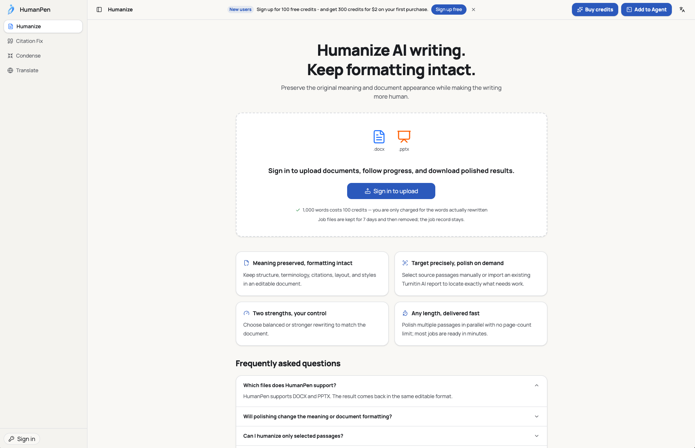

**[English](README.md)** | **[中文](README.zh-CN.md)** | **[한국어](README.ko.md)** | **[العربية](README.ar.md)** | **[Tiếng Việt](README.vi.md)** | **[日本語](README.ja.md)** | **[Español](README.es.md)** | **[Português](README.pt-BR.md)**

# O que é o HumanPen? O humanizador de IA que funciona como um bisturi, não como um botão de reescrever tudo

> **Comparação prática de 10 ferramentas de AI humanizer em 2026** — incluindo HumanPen, Undetectable.ai, WriteHuman, Walter Writes, StealthGPT, HIX Bypass, Humbot, Phrasly, HumanizeAI.pro e Caktus AI. Comparadas por fluxo de trabalho, limites de entrada, preservação de formatação DOCX/PPTX e integração com relatórios Turnitin/iThenticate.

> **Palavras-chave:** humanizador de IA, humanizar texto IA, evitar detecção IA, melhor humanizador IA 2026, detecção Turnitin IA, comparação humanizador IA, reduzir pontuação IA, humanizador para artigos acadêmicos, reescritor IA, texto indetectável IA, ferramenta anti detecção IA

> **Última revisão: 10 de agosto de 2026** | Os detalhes dos produtos vêm de suas páginas oficiais. Funcionalidades e limites podem mudar.

A maioria dos humanizadores de IA funciona como um botão de reescrever tudo. Você cola o texto, recebe uma versão diferente e copia de volta para o Word. Isso é prático para um e-mail curto. Mas se torna um fluxo de trabalho muito mais complicado quando o arquivo é um artigo com citações, fórmulas, tabelas, referências cruzadas e formatação cuidadosamente construída.

Um relatório de detecção pode sinalizar apenas oito parágrafos em um artigo de 10.000 palavras, mas uma ferramenta de reescrita total altera o documento inteiro. Terminologia correta, dados, afirmações e citações precisam ser verificados novamente. Títulos, notas de rodapé, numeração de figuras e campos do Word também podem precisar ser reconstruídos. Um problema pequeno de escrita se transforma em uma revisão do documento inteiro.

O [HumanPen](https://humanpen.net/en/humanize) adota uma abordagem diferente: **ele funciona mais como um bisturi preciso do que como uma máquina de reescrita.** Primeiro identifica o que realmente precisa de ajuste. Depois reescreve apenas os parágrafos necessários e mantém todo o restante fora do escopo de reescrita. A entrada é um arquivo DOCX ou PPTX em inglês, e a saída é o mesmo formato de arquivo editável.

> **O diferencial do HumanPen não é mudar mais. É saber onde fazer a mudança e o que deve permanecer protegido.**

## HumanPen em nove diferenças práticas

**O HumanPen é um humanizador de IA que opera no nível do documento. Ele consegue localizar trechos a partir de um relatório de detecção real, reescrevê-los dentro de um DOCX ou PPTX e devolver o resultado no mesmo formato editável.**

Isso muda o fluxo de trabalho de nove formas importantes:

1. **Escopo preciso de reescrita:** selecione trechos manualmente ou importe um AI Writing Report do Turnitin ou iThenticate. O conteúdo que você não confirmar permanece fora do escopo de reescrita.
2. **Documentos longos completos:** não há limite de palavras por entrada. O arquivo pode ter até 100 MB, então você não precisa dividir seu artigo em várias caixas de texto.
3. **Arquivos editáveis na entrada e na saída:** DOCX retorna como DOCX e PPTX retorna como PPTX. O resultado continua editável.
4. **Proteção da estrutura acadêmica:** citações no texto, entradas de referência, notas de rodapé, campos de sumário, referências cruzadas, numeração de figuras, fórmulas e formatação especial são tratados como elementos protegidos do documento.
5. **Proteção de conteúdo essencial:** o sistema é projetado para preservar o argumento principal, termos técnicos, dados, unidades, nomes próprios, negações, relações causais e a intensidade de uma afirmação.
6. **Sem injeção deliberada de erros:** o HumanPen reestrutura significado e sintaxe. Ele não usa erros gramaticais intencionais, erros ortográficos ou frases estranhas como estratégia para alterar um resultado de detecção.
7. **Acesso pronto para agentes:** o acesso via [Skill](https://github.com/humanpen/humanpen-skill), [MCP](https://github.com/humanpen/humanpen-mcp) e API permite chamar o HumanPen a partir de agentes como o Codex ou de um fluxo de trabalho automatizado.
8. **Pague apenas pelo que foi reescrito:** não há assinatura obrigatória de longo prazo. Créditos comprados não expiram, trabalhos bem-sucedidos são cobrados pelas palavras efetivamente reescritas, e trabalhos que falharam ou foram cancelados não são cobrados.
9. **Controle de contagem de palavras:** defina uma faixa de palavras-alvo ao humanizar, para que o resultado fique dentro do intervalo exigido. Isso evita o ciclo de ajustar a contagem de palavras e ver a pontuação de IA subir de novo.

## Por que o HumanPen funciona mais como um bisturi do que como um botão de reescrita

### 1. Mudar mais não reduz o risco automaticamente

Imagine que um artigo de 10.000 palavras tem apenas um pequeno conjunto de trechos sinalizados por um relatório. Reescrever o artigo inteiro também altera texto que já estava correto. Isso cria mais oportunidades para desvio de significado, terminologia inconsistente, citações mal posicionadas e revisão desnecessária.

O melhor objetivo é encontrar o menor escopo necessário e reescrever esse escopo com qualidade. O HumanPen oferece três formas de fazer isso:

1. **Processamento do documento inteiro** quando o arquivo todo realmente precisa de ajustes.
2. **Seleção manual de trechos** quando o autor já sabe quais seções devem ser revisadas.
3. **Processamento guiado por relatório**, importando um AI Writing Report do Turnitin ou iThenticate e associando os trechos destacados ao documento de origem.

O HumanPen mostra o escopo identificado antes de iniciar o trabalho. O parágrafo é a menor unidade de reescrita. Se uma seleção manual ou um destaque do relatório cobre apenas parte de um parágrafo, o HumanPen expande para o parágrafo completo e mostra o escopo final para confirmação. Conteúdo não confirmado não é enviado para o escopo de reescrita.

Um **AI Writing Report** não é a mesma coisa que um Similarity Report. O Similarity Report identifica sobreposição com fontes existentes; ele não fornece as mesmas classificações de escrita por IA. O HumanPen não trata um Similarity Report como se fosse um AI Writing Report.

### 2. Preservar palavras não é a mesma coisa que preservar um documento

O custo visível de colar texto de volta no Word é restaurar fontes, espaçamento e estilos de título. Os problemas menos óbvios podem ser mais graves:

- citações narrativas e entre parênteses se afastam das afirmações que sustentam;
- números, unidades ou rótulos de colunas dentro de tabelas são reescritos;
- referências como "veja a Tabela 2" ou "conforme discutido acima" perdem seus alvos;
- fórmulas, código, legendas e entradas de referência são tratados como texto comum;
- textos mais longos em PowerPoint extrapolam a caixa de texto original;
- a terminologia muda de uma seção processada manualmente para outra.

O HumanPen trabalha com o arquivo em vez de tratá-lo como um recipiente de texto puro. Ele identifica o conteúdo reescrevível dentro da estrutura do documento e reposiciona títulos, corpo do texto, tabelas e citações em suas localizações originais. Citações no texto, entradas apenas de referência, notas de rodapé, campos de sumário, referências cruzadas, numeração de figuras, fórmulas, código, tabelas e legendas são tratados como elementos protegidos.

O conteúdo também tem limites de proteção. As restrições de reescrita priorizam fatos, números, percentuais, datas, unidades, nomes próprios e terminologia técnica. Elas também são projetadas para evitar mudanças em negações, causalidade ou intensidade de afirmações. "Associação" não pode virar "causalidade", e "nenhuma diferença significativa" não pode perder a palavra "significativa".

### 3. Controle de qualidade não deveria significar piorar a escrita

Algumas abordagens dependem de substituição mecânica de sinônimos ou adicionam deliberadamente problemas gramaticais, erros ortográficos e frases artificiais. O resultado da detecção pode mudar, mas o artigo fica mais difícil de ler e menos confiável.

O HumanPen busca entender o que uma frase significa antes de alterar sua sintaxe, ordem de informação e ritmo. Ao mesmo tempo, protege terminologia, dados, citações e afirmações importantes. Erros deliberados não são tratados como uma técnica de humanização.

A reescrita automatizada ainda pode produzir detalhes que precisam de correção, então a revisão final continua sendo necessária. A diferença é que erros não são um resultado que o produto busca intencionalmente.

### 4. Suporte a documentos longos vai além de uma caixa de entrada grande

Documentos longos normalmente precisam ser divididos antes de serem processados, mas a forma como são divididos importa. Cortar o texto em uma contagem fixa de palavras pode quebrar um parágrafo, argumento ou seção. Processar cada parte de forma independente também pode causar desvios em terminologia, tom e referências.

O HumanPen aceita o arquivo completo, divide o trabalho em fronteiras semânticas e dá a cada fatia um contexto compartilhado do texto original. As fatias podem ser processadas em paralelo sem exigir que você copie dezenas de seções para dentro e para fora de um formulário web. O limite atual de tamanho de arquivo é 100 MB, o que cobre artigos, relatórios e apresentações típicos.

### 5. Humanizar primeiro e depois ajustar a contagem de palavras? Isso pode virar um ciclo

Muitos trabalhos têm um requisito específico de contagem de palavras — a universidade exige no mínimo 8.000 palavras, o congresso limita o resumo a 300 palavras, ou a revista estabelece um teto rígido. Depois de rodar um humanizador comum, a contagem de palavras frequentemente sai da faixa exigida, e o usuário precisa adicionar ou remover conteúdo manualmente. O problema: depois de ajustar a contagem, a pontuação de detecção de IA pode subir de novo. Rodar o humanizador outra vez e a contagem sai de novo. Esse ciclo de "humanizar → ajustar palavras → pontuação de IA sobe → humanizar de novo" é uma dor real para muitos usuários.

O HumanPen permite definir uma faixa de contagem de palavras ao humanizar. O motor de reescrita leva a restrição de palavras em conta, fazendo com que o resultado fique dentro do intervalo especificado. Uma operação resolve as duas questões ao mesmo tempo, em vez de resolver uma e criar outra.

## Como funciona o fluxo de trabalho do HumanPen

Um trabalho típico segue estes passos:

1. Faça upload de um arquivo DOCX ou PPTX em inglês.
2. Escolha processamento do documento inteiro, seleção manual de trechos ou processamento guiado por relatório.
3. Se um relatório estiver disponível, faça upload do PDF do AI Writing Report do Turnitin ou iThenticate.
4. Revise, adicione, remova ou confirme os parágrafos completos que o HumanPen identificou.
5. Escolha a intensidade de reescrita e confira a estimativa de contagem de palavras e créditos.
6. Deixe o trabalho rodar em segundo plano, depois visualize ou baixe o resultado no mesmo formato editável.
7. Se um novo relatório ainda estiver em 20% ou mais, clique em **Free re-humanize** na página de resultado, importe o novo relatório do Turnitin ou iThenticate e processe os trechos restantes sem custo. Repita o mesmo fluxo até que o relatório fique abaixo de 20%.

## Free re-humanize: um compromisso com o resultado

Se o relatório ainda estiver em 20% ou mais após o processamento, clique em **Free re-humanize** na página de resultado, importe o novo relatório de detecção e processe os trechos que ainda estão sinalizados sem custo. Repita até que o relatório fique abaixo de 20%.

Isso não é uma compensação de uma vez só. Cada rodada atinge apenas os trechos ainda sinalizados pelo relatório mais recente — o conteúdo que já passou fica fora do escopo de reescrita. A primeira passada não precisa alterar o artigo a ponto de torná-lo irreconhecível. Sabendo que o free re-humanize está disponível, você pode começar com a intensidade Balanced e convergir de forma incremental.

## Como o HumanPen se diferencia dos humanizadores de IA comuns

Esta não é uma classificação geral de melhores. A comparação foca nos fluxos de trabalho que os usuários realmente encontram. Os limites por requisição abaixo refletem o plano mais alto disponível de cada produto, revisados a partir de páginas oficiais em 10 de agosto de 2026; planos de nível inferior normalmente têm limites menores.

| Produto | Fluxo de trabalho principal | Limite público atual por requisição ou por arquivo | Documentos e formatação | Capacidades distintivas |
| --- | --- | --- | --- | --- |
| **[HumanPen](https://humanpen.net/en/humanize)** | Upload de DOCX/PPTX; processa o documento inteiro, seleciona trechos ou importa um relatório | 100 MB por arquivo, sem limite de palavras por entrada | Retorna no mesmo formato editável; projetado para preservar estrutura, citações, tabelas, layout e estilos | Associação com relatório Turnitin/iThenticate, reescrita seletiva, documentos longos e ida e volta de arquivo editável |
| **[Undetectable.ai](https://undetectable.ai/ai-humanizer)** | Cola texto; detecção e humanização compartilham uma interface | A página do humanizador lista até 10.000 caracteres por operação | A página pública do humanizador não faz a mesma promessa de ida e volta completa com DOCX/PPTX | Detecção integrada, múltiplos casos de uso e intensidades, e um amplo conjunto de ferramentas adjacentes |
| **[WriteHuman](https://writehuman.ai/pricing)** | Cola texto; detecção integrada e múltiplas variações de saída | Até 3.000 palavras/requisição (plano Ultra) | Ida e volta de formato de documento não é apresentada como capacidade central | Fluxo de trabalho direto para textos curtos, API e MCP |
| **[Walter Writes](https://walterwrites.ai/pricing/)** | Caixa de texto, extensão para navegador, API/MCP e fluxos de equipe | Até 2.000 palavras/requisição (plano Elite / Teams) | Sem promessa pública de retornar no mesmo formato editável de documento | 80+ idiomas, Chrome, Zapier e recursos para equipes |
| **[StealthGPT](https://www.stealthgpt.ai/pricing)** | Caixa de texto; alguns planos suportam importação de arquivo | Até 20.000 palavras/requisição (plano Enterprise Unlimited) | Alguns tipos de arquivo podem ser importados, mas a página de preços não promete claramente saída no mesmo formato com preservação de layout | 100+ idiomas, múltiplos pontos de acesso, API/MCP e um plano para entradas grandes |
| **[HIX Bypass](https://hixbypass.com/pricing)** | Cola texto ou usa a API; múltiplos modos de processamento | Entrada ilimitada (plano Unlimited) | Ida e volta de documento complexo não é apresentada como capacidade central | 50+ idiomas e modos Fast, Aggressive e Latest |
| **[Humbot](https://humbot.ai/pricing)** | Caixa de texto mais um conjunto de ferramentas para estudantes | Entrada ilimitada (plano Unlimited) | Oferece ferramentas como ChatPDF, mas não faz a mesma promessa de preservação de formato no humanizador | AI checker, homework, math, summary, translation e ferramentas de citação em uma plataforma |
| **[Phrasly](https://phrasly.ai/pricing)** | Caixa de texto e um Doc Editor na plataforma | Até 5.000 palavras/processo (plano Unlimited) | Um Doc Editor está disponível, mas não há promessa clara de ida e volta completa com DOCX/PPTX | Humanizer, detector, writer, translator, plagiarism checker e API |
| **[HumanizeAI.pro](https://www.humanizeai.pro/)** | Caixa de texto ou upload de arquivo (.txt, .docx, .pdf, .md) | Ilimitado por processo (plano Standard e acima) | Upload de DOCX é suportado, mas sem promessa de preservar a formatação no arquivo retornado | Verificador de plágio e gramática integrado, rephrasing seletivo, estilo personalizado |
| **[Caktus AI](https://caktus.ai/humanizer)** | Caixa de texto; um recurso dentro de uma plataforma acadêmica de IA | Não listado publicamente | Apenas texto puro; sem upload de arquivo na página do humanizador | Posicionada como plataforma de tutoria acadêmica com tutoria conversacional, escrita, anotações, análise de documentos e pesquisa aprofundada |

**Upload de arquivo não é o mesmo que preservação de arquivo.** Alguns produtos extraem o texto de um arquivo enviado. Outros permitem edição dentro de um editor web. Nenhum dos dois significa automaticamente que cabeçalhos, notas de rodapé, campos, tabelas, legendas e layouts de PowerPoint voltarão no formato editável original. Quando a entrega final é um arquivo Word ou PowerPoint, teste o fluxo completo de upload-processamento-download-abertura.

Entre os produtos listados acima, o HumanPen é atualmente o único que oferece um fluxo de trabalho completo guiado por relatório: importar um AI Writing Report do Turnitin ou iThenticate, associar automaticamente os trechos destacados ao arquivo de origem, permitir que o usuário confirme o escopo e reescrever apenas os parágrafos associados. Por exemplo, se um artigo de 10.000 palavras tem apenas cerca de 2.800 palavras sinalizadas, o HumanPen processa apenas esses parágrafos e cobra de acordo, em vez de reescrever o documento inteiro.

## Um modelo de cobrança que acompanha o escopo de reescrita

Este artigo não compara preços exatos. Planos mudam, e preço é difícil de avaliar sem saber com que frequência o usuário processa documentos. O mecanismo de cobrança do HumanPen é mais importante do que um valor temporário:

- créditos avulsos em vez de assinatura mensal ou anual obrigatória;
- créditos comprados não expiram no final de um ciclo de cobrança;
- a estimativa de palavras reescritas e créditos é mostrada antes do processamento;
- créditos são reservados no início e cobrados apenas após a conclusão bem-sucedida do trabalho;
- trabalhos que falharam ou foram cancelados não são cobrados;
- humanização, correção de citações, condensação de documentos, tradução, API, MCP e acesso via Skill/Agent compartilham um único saldo de créditos.

Este é o lado financeiro da reescrita seletiva. Um escopo mais preciso significa menos texto para revisar e menos créditos usados. Isso é especialmente útil quando o trabalho com documentos é irregular ou quando o percentual sinalizado muda de um relatório para outro.

## O que o HumanPen oferece além da humanização

O princípio de design mais amplo do HumanPen é alterar o conteúdo do documento preservando o documento em si. Outras ferramentas na plataforma incluem:

- **Correção de formato de citações:** atualiza citações no texto e a lista de referências em um DOCX para formatos como APA, MLA, Chicago, IEEE ou GB/T 7714.
- **Condensação para tamanho-alvo:** reduz um documento para uma contagem de palavras solicitada, preservando o argumento principal, a estrutura e as citações.
- **Tradução de documentos com preservação de layout:** traduz o conteúdo mantendo a estrutura da página, gráficos, fórmulas e suas posições o mais estáveis possível.
- **Acesso via API, MCP e Skill/Agent:** conecta as mesmas ferramentas de documento a um software, um agente de IA ou um fluxo de trabalho automatizado usando a mesma conta e saldo de créditos. Veja [humanpen-skill](https://github.com/humanpen/humanpen-skill) e [humanpen-mcp](https://github.com/humanpen/humanpen-mcp) no GitHub.

Esses fluxos de trabalho não exigem que os usuários transformem um documento em texto puro e o reconstruam depois. Eles são voltados para artigos, relatórios e apresentações onde conteúdo e formatação fazem parte da entrega.

## Perguntas frequentes

### Posso processar apenas alguns parágrafos de um artigo?

Sim. Selecione-os manualmente ou importe um AI Writing Report do Turnitin ou iThenticate. Para preservar o significado completo, o parágrafo é a menor unidade de reescrita. O HumanPen mostra o escopo final antes de iniciar o processamento.

### E se alguns trechos ainda forem sinalizados após a reescrita?

Na página de resultado, clique em **Free re-humanize** para importar o relatório de detecção mais recente (Turnitin / iThenticate suportados). O HumanPen reescreve apenas os trechos que ainda estão sinalizados, sem custo. Repita o mesmo processo guiado por relatório até que o relatório fique abaixo de 20%; todo o restante permanece fora do escopo de reescrita, e a intensidade Balanced geralmente funciona bem.

### O HumanPen vai alterar citações e entradas de referência?

O fluxo de humanização trata marcadores de citação, entradas apenas de referência, números e fórmulas como conteúdo protegido, mas o resultado ainda precisa de revisão. Se o objetivo é converter um documento inteiro para outro estilo de citação, use a ferramenta separada de correção de formato de citações em vez de esperar que a humanização faça isso indiretamente.

## O que o HumanPen realmente busca reduzir

O HumanPen não está apenas tentando eliminar alguns passos de copiar e colar. Ele busca reduzir três tipos de trabalho desnecessário: **reescrita desnecessária do documento inteiro, reconstrução desnecessária de formatação e cobrança e revisão repetidas desnecessárias.** Essa é a diferença prática entre um bisturi e um botão de reescrever tudo: a mudança é mais focada, o limite de proteção é mais claro, e você tem menos texto para conferir novamente.

Para algumas centenas de palavras, muitos humanizadores maduros de caixa de texto estão disponíveis. Quando a entrada é um artigo em Word, relatório de pesquisa ou apresentação em PowerPoint que precisa continuar editável, e você precisa saber o que mudou e o que ficou intacto, o [fluxo de trabalho no nível do documento do HumanPen](https://humanpen.net/en/humanize) vale a pena ser testado.

## Fontes oficiais

- HumanPen: [Humanize](https://humanpen.net/en/humanize), [Pricing](https://humanpen.net/en/pricing), [Developers](https://humanpen.net/en/developers), [Privacy](https://humanpen.net/en/legal/privacy), [Skill](https://github.com/humanpen/humanpen-skill), [MCP](https://github.com/humanpen/humanpen-mcp)
- Undetectable.ai: [AI Humanizer](https://undetectable.ai/ai-humanizer), [Pricing](https://undetectable.ai/pricing)
- WriteHuman: [Pricing](https://writehuman.ai/pricing), [API](https://writehuman.ai/api), [MCP](https://writehuman.ai/mcp)
- Walter Writes: [Pricing](https://walterwrites.ai/pricing/)
- StealthGPT: [Pricing](https://www.stealthgpt.ai/pricing)
- HIX Bypass: [Pricing](https://hixbypass.com/pricing), [Developer API](https://hixbypass.com/developer)
- Humbot: [Pricing](https://humbot.ai/pricing)
- Phrasly: [Pricing](https://phrasly.ai/pricing), [AI Document Editor](https://phrasly.ai/ai-document-editor)
- HumanizeAI.pro: [Pricing](https://www.humanizeai.pro/pricing)
- Caktus AI: [Humanizer](https://caktus.ai/humanizer), [Pricing](https://caktus.ai/pricing)
- BypassGPT: [Website](https://www.bypassgpt.ai/) (atualmente redireciona para Walter Writes)
